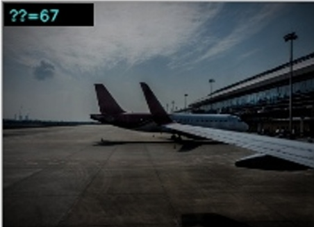
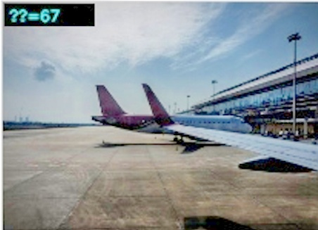
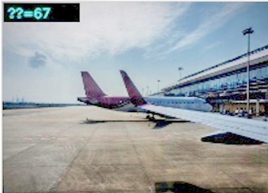

# Low-Light Image Enhancement

A classical pipeline that lifts a low-light photo toward the brightness, local contrast, and sharpness of a normal exposure.

It is built from the methods in the project papers:

- **LIME** (Guo, Li, Ling) — per-pixel illumination from the max RGB channel, smoothed so the map follows edges
- **Adaptive gamma / gray-world colour** (Huang, Cheng, Chiu, AGCWD family) — the lift depends on how crushed the capture is, instead of one gamma for every photo
- **Edge-aware smoothing** — a guided filter keeps strong edges and drops fine grain

Ground truth is never used inside the enhancer. It is only used afterwards, in `evaluate_lol.py`, to compute PSNR and SSIM.

## What was going wrong

The previous stack was a fixed gamma (1.8), CLAHE on 8×8 tiles, a wide bilateral filter (`d=9`, `σ=75`), and a small saturation boost.

That produced three visible failures:

- **Dark patches.** One gamma lifts the whole frame by the same curve, so a corner that is darker than the rest stays dark. CLAHE tiles then made those regions blotchy.
- **Low brightness.** Very dark captures (no highlight left in the file) were still far below the normal-light photo.
- **Blur.** The bilateral kernel removed the texture that is still visible in the ground truth: book titles, fabric, faces.

## Pipeline

```text
Low-light input
      │
      ▼
Illumination map          max(R, G, B), guided-filter smooth
      │                   divide by illumination^0.7
      ▼
Adaptive tone             extra gain only if the frame is uniformly crushed
      │                   otherwise a mild gamma, plus a capped midtone lift
      │                   partial gray-world balance
      ▼
Detail refine             guided filter, strong edges added back
      ▼
Colour restore            a little saturation on midtones only
      │
      ▼
Enhanced image
```

CLAHE and the wide bilateral filter are not in this path. The old functions are still in `modules/gamma.py`, `modules/clahe.py`, and `modules/bilateral.py` so the previous stages can be read, but nothing calls them.

Parameters live in `config.py`.

## Results on the paired test sets

Same pairs as before. Higher PSNR is closer in pixel value. Higher SSIM is closer in structure.

| Dataset | Images | Previous PSNR | Previous SSIM | This pipeline PSNR | This pipeline SSIM |
|---|---:|---:|---:|---:|---:|
| LOL eval15 | 15 | 14.49 dB | 0.7684 | **20.14 dB** | **0.8005** |
| LOL-v2 Real test | 100 | 18.52 dB | 0.8089 | **18.56 dB** | 0.7571 |
| LOL-v2 Synthetic test | 100 | — | — | **19.77 dB** | **0.8288** |

LOL is the set that looked dark and patchy. Mean PSNR there rises by about 5.7 dB, and the frames that used to fail move with it: `23.png` from 8.59 dB to 16.82 dB, `111.png` from 11.33 dB to 20.69 dB, `55.png` from 8.75 dB to 15.78 dB.

LOL-v2 PSNR is slightly higher than before. SSIM is lower because the old bilateral filter was blurring the output toward the smoother ground truth. The new outputs keep more of the real texture. Side-by-side figures are in `results/`.

The synthetic test was not part of the old gamma–CLAHE run, so there is no previous score for it. The raw synthetic inputs already sit at 11.22 dB / 0.4450 SSIM, higher than the real sets, because the darkness is generated rather than captured. Illumination recovery does most of the work (20.23 dB / 0.8948). The later denoise trims a little of that SSIM, because these ground truths are clean and sharp. The full test still finishes at 19.77 dB, with a best frame of 31.08 dB (`r191488c6t.png`) and a weakest of 10.19 dB (`r01058910t.png`), where the output stays soft and washed out.

Comparisons (low-light | enhanced | ground truth):

- LOL: `results/LOL/comparisons/`
- LOL-v2 Real, three highest-PSNR frames: `results/LOLv2_Real/comparisons/`
- LOL-v2 Synthetic, best, median, and lowest PSNR: `results/LOLv2_Synthetic/comparisons/`

Per-image scores: `results/LOL/metrics.csv`, `results/LOLv2_Real/metrics.csv`, and `results/LOLv2_Synthetic/metrics.csv`.

## Stage screenshots

Input, then each stage, on `input/input.png`.

| Stage | Image |
|---|---|
| Input |  |
| Illumination |  |
| Adaptive tone |  |
| Detail refine |  |
| Final |  |

## Setup

```bash
python -m venv venv
source venv/bin/activate          # Windows: venv\Scripts\activate
pip install -r requirements.txt
```

Put low-light photos in `input/` and run:

```bash
python main.py
```

Stage images are written to `output/`.

## Scoring against ground truth

Download [LOL](https://daooshee.github.io/BMVC2018website/) and [LOL-v2 Real](https://github.com/flyywh/CVPR-2020-Semi-Low-Light). Point `config.py` at the folders if auto-detect does not find them. The file already checks, in order:

- `data/hf/LOLdataset/eval15/{low,high}` and `data/hf/lol-v2-real/Test/{Low,Normal}`
- `data/hf/lol-v2-synthetic/Test/{Low,Normal}`
- `data/LOLdataset/...`, `data/lol-v2-real/...`, and `data/lol-v2-synthetic/...`
- the original Windows paths

LOL-v2 Real pairs `low00690.png` with `normal00690.png`. LOL and LOL-v2 Synthetic use the same filename in both folders.

```bash
python evaluate_lol.py --dataset lol
python evaluate_lol.py --dataset lolv2
python evaluate_lol.py --dataset lolv2syn
python make_comparisons.py
python make_comparisons_v2.py
python make_comparisons_v2.py --dataset lolv2syn
python generate_final_report.py
```

## Layout

```text
config.py                 parameters and dataset paths
main.py                   enhance images in input/
evaluate_lol.py           PSNR, SSIM, ablation on LOL or LOL-v2
make_comparisons.py       LOL side-by-side figures
make_comparisons_v2.py    LOL-v2 figures for the top PSNR frames
modules/pipeline.py       stage order
modules/illumination.py   LIME map and division
modules/tone.py           crushed-exposure lift and midtone anchor
modules/refine.py         edge-preserving denoise
modules/color_restore.py  midtone saturation
modules/evaluation.py     PSNR and SSIM
```

## Limits

A single classical pipeline cannot know whether a scene is supposed to be a bright room or a dark street. Frames whose ground truth is deliberately dim (some night shots in LOL) can come out a little brighter than that photo. Very crushed frames still show some of the sensor noise that was hiding in the blacks; the refine stage suppresses it without the old bilateral smear.

## Author

Sanjay Kumar Sahoo — B.Tech, Computer Science & Engineering
